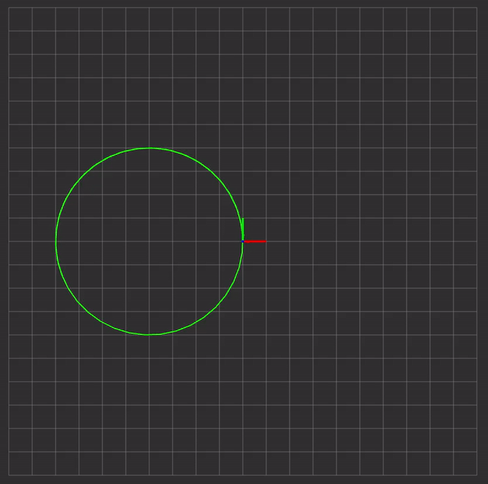
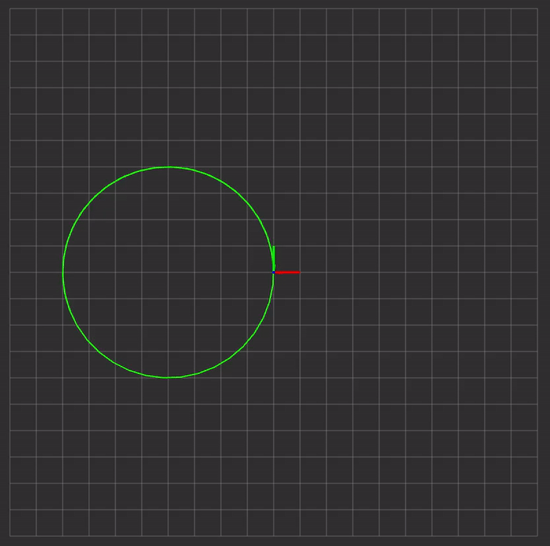
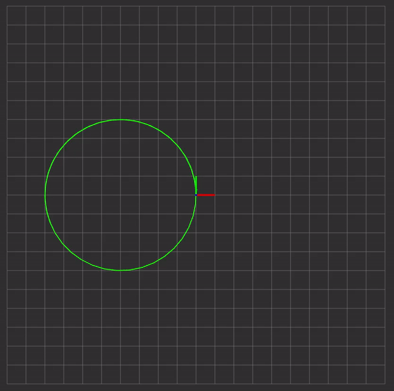
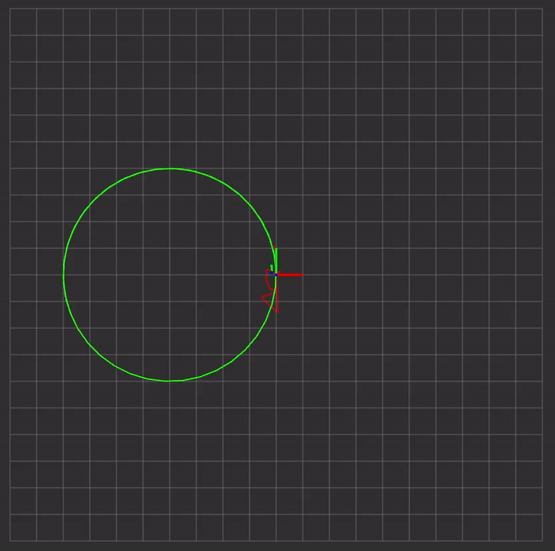
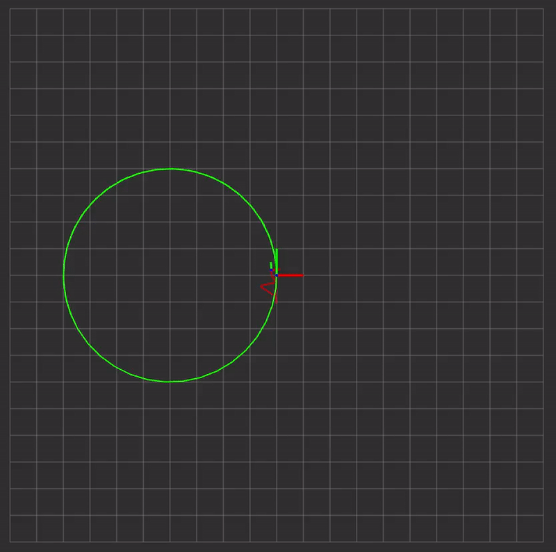
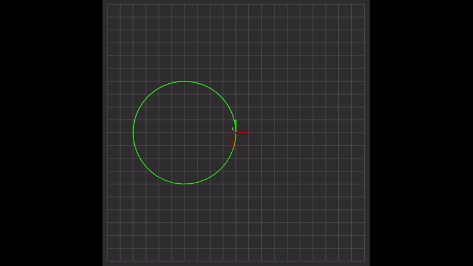
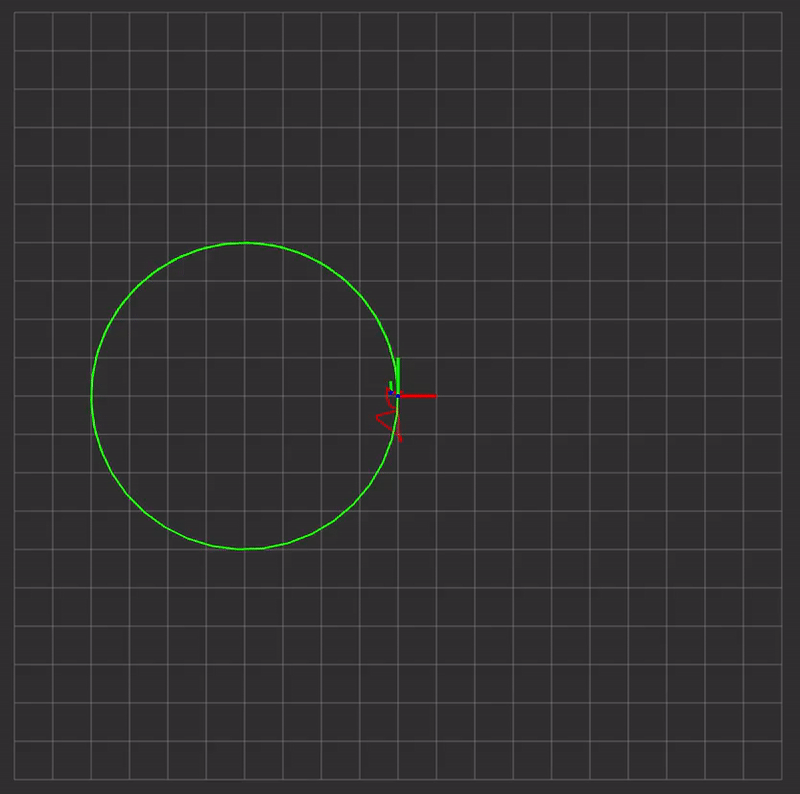

# Model Predicive Contouring Control

### Demos

(updated on 09/26)

|  |  |  |
|:--:|:--:|:--:|
|**Iris (No Wind)**|**Iris (Wind)**|**Iris (Wind+L1)**|
|  |  |  |
|**Typhoon (No Wind) x4**|**Typhoon (Wind) x4**|**Typhoon (Wind+L1) x4**|
||
|**Typhoon with mpc_kepco_test x4**|

### Usage
**Iris**
```bash
roslaunch mpcc quadrotor_gazebo.launch #gui:=false
rosrun mpcc test_circle.launch # or test_lemniscate.launch
```
**Typhoon_h480**
```bash
roslaunch gazebo_test.launch
rosrun mpcc test_kepco_circle.launch
```

### Updates

- **23-10-10**
  - 사용하지 않는 파일들 삭제 및 `mpc`를 `mpcc`로 모두 명명 변경 (To fix symbol lookup error)
  - [mpc_test.h](include/mpcc/mpc_test.h):
    - `reference_states_`에서 `t`와 `vt` 모두 0으로 변경. reference에 값을 넣으면 LSQ Term에서 차이값에 대해 QPOASES가 풀리기 때문에 여기에는 0을 넣고 Cost function을 weight를 조정해서 맞춤.
    - $vt \approx 1$ 일 때 전역 경로에 대한 드론의 위치가 적절한데 현재는 값이 불분명함.
    - States $q, v, v_t, a_t$ 에 weight 0.01 을 부여
    - Inputs $T, w_x, w_y, w_z, \bar{J_t}$에 rosparam으로 weight 부여하도록 하고 최대한 작은 값인 0.1 넣음 Roll, Pitch는 너무 작으면 불안정하여 0.05를 넣음
  - Thrust mappng 관련 변수인 `norm_thrust_const`, `norm_thrust_offset`을 튜닝
  - `min_throttle`이 너무 작으면 처음 타겟인 호버링 지점으로 갈 때 비정상적인 비행을 함. 현재도 typhoon 기체는 호버링 위치보다 더 높게 올라간 후에 경로점으로 비행시작함.(L1을 같이 사용하면 정상적임)

<details>
  <summary><b>Previous updates</b></summary>

- **23-09-26**
  - [bezier_curve.h](include/mpcc/bezier_curve.h): 경로점 6개를 받아 5차 베지어 커브를 생성
  - [bezier_curve_test.h](include/mpcc/bezier_curve_test.h): `nav_msgs/Path` 콜백함수으로 베지어 경로를 생성하고 다시 `Path`로 생성. `bezier_curve.h` 디버깅을 위한 테스트 코드
  - [mpc_test.h](include/mpcc/mpc_test.h):
    - `target_traj_cb`에서 `bezier_curve.h`로 경로점 6개 넘겨주도록 수정
    - `reference_states_`에서 `t`에 ros::Duration으로 dt 더해줌. `vt`는 1로 수정
    - `set_params()`에서 W, Wlx를 $\theta^{(N)}$까지 dynamic하게 들어가도록 수정
  - [mpc_wrapper.cpp](src/mpc_wrapper.cpp): 이에 맞게 `setCosts` 수정
  - 추후 코드 리팩토링 필요 (kSamples 루프가 mpc_test와 mpc_wrapper에서 2번 돌고 있음)

- **23-09-16**
  - [mpc_wrapper.cpp](src/mpc_wrapper.cpp):
    - 아래 디버깅 파트 설명 중 qpOASES에서 31을 반환하여, quadratic form의 일부 state와 input에 weight를 1로 두었다. 이렇게 되면  $q^2, v^2$으로 들어가 Cost function과 맞지 않음.
    - 그래서 `acado_reference_state_`를 모두 0으로 하지 않고 $[q_w, q_x, q_y, q_z, v_x, v_y, v_z, a_t \|T, w_x, w_y, w_z]$에는 값을 넣어줌.
    - Cost function에서 사용하는 $`\|\begin{bmatrix}p_x\cr p_y\cr p_z\cr t\cr v_t\end{bmatrix}-\begin{bmatrix}0\cr 0\cr 0\cr 0\cr 0\end{bmatrix}\|`$에는 $W$가 적용되고, 나머지에는 1로 weight 적용됨.
- **23-09-14**
  - [acado 메뉴얼](https://acado.sourceforge.net/doc/pdf/acado_manual.pdf) p.103-105에 따라 `acado model`, `mpc_wrapper`, `mpc_test` 파일 모두 수정
    - [quadrotor_model_thrustrates.cpp](model/quadrotor_model_thrustrates.cpp):
      - 기존 MPC처럼 `h`, `hN`을 각각 state+input, state 벡터로 변경해줌. (메뉴얼 p.105 참고)
    - [mpc_wrapper.cpp](src/mpc_wrapper.cpp):
      - 위 모델에 맞게 기존 MPC와 유사하게 matrix 크기를 수정해줌.
      - 예를 들어, `kRefSize` 였던 `Q`를 `kStateSize`로 수정하고 R도 `kInputSize`로 수정함.
      - 이전 업데이트에서는 `Q`를 quadratic term의 weight matrix, `R`을 linear term weight matrix로 사용했지만, 기존 MPC처럼 Q+R로 바꿔주고 새로운 `q`로 linear term weight matrix로 사용하고 이에 맞게 `setCosts`나 `set_params` 수정.
  - 디버깅:
    - `acado_feedbackStep()`의 returnValue로 qpOASES의 상태를 확인할 수 있는데, 기존 방식(reference의 5개의 state만 사용)에서는 31을 반환함. 이는 **RET_DIFFERENTIAL_STATE_DIMENSION_MISMATCH**에 해당함.([참고 L101](http://docs.ros.org/en/melodic/api/acado/html/acado__message__handling_8cpp_source.html))
    - 원인을 메뉴얼대로 모델을 사용하지 않은 것으로 추측하여, 위 수정사항 설명처럼 `LSQTerm`을 state+input으로 구성하고 weight matrix에서 0을 넣어주고자 하였음.(아래 Cost function 참고)
    - 문제는 `Q`(mpc_wrapper) 또는 `W`(acadoVarialbes.W)의 quaternion, velocity 등에 0을 넣어주면 ODE constraint에서 풀리지 않아(메뉴얼 p.103) gazebo 테스트에서 rpy값이 0이 나옴.
    - 따라서, $[p_x, p_y, p_z, t, v_t]$를 제외한 state와 input은 weight를 1로 넣어줌.
    - `t`,`vt`,`at` 쪽은 출력으로 확인해보니 ros Time에서 seconds로 바뀌면서 전체 horizon `N`에 대해 같은 값을 가지고 있음. `est_state_`나 `predicted_states_`의 값이 적절해보이고, ODE모델에서 다른 state나 input에 영향이 없으므로 현재 문제의 원인으로는 고려 X. 추후 수정 필요해보임.
    - $l_2$-norm 의 weight matrix `W`에 0을 넣으면 문제가 생기는 것은 파악했으나, `Wlx`가 어떤 식으로 사용되는지 명확하지 않아 확인이 필요함.
- **23-09-12**
  - 기존 Cost function을 quadratic form 에서 $l_2$-norm으로 바꿔줌. OSQP에서는 Reference에 해당하는 부분을 $x^TQx+q^Tx$의 $Q, q$에 넣어주었지만, ACADO에서는 별도로 reference state가 주어진다. 따라서 *acadoVariables.y*에는 0을 넣어주고 weight matrix를 그대로 사용하고자 함.
  - Gazebo 테스트 중 비정상적으로 비행하여서, 출력문을 통해 디버깅 중.
  - acado_inputs에 값이 정상적으로 변하지 않아 acado_feedbackStep() returnValue로 원인 파악 중.
  - *acadoVariables.y*를 기존 MPC처럼 state+input으로 변경해주어야 할 것으로 보임.
- **23-09-07**
  - `acado_Wlx`가 $`273*1`$의 column vector, `mpc_wrapper`의 `Wlx_`는 $13*1$의 column vector이므로 `Eigen::Matrix<T, kStateSize, kStateSize> R` 과 `R_`을 Matrix에서 Vector로 수정.(`kStateSize x (kSamples+1) = 273`)
  - CMPCC를 참고하여 `set_state_est`, `set_params`와 `solve_mpc` 수정.
  - `est_state_`의 `vt`, `at`를 이전 결과로부터 가져오도록 수정. 우선, `solve_from_scratch_` 조건문에 update되는 부분을 넣음. 추후 필요시 리팩토링
    ```cpp
      // SOLVE MPC
    if (solve_from_scratch_) {
      ROS_INFO("Solving MPC with hover as initial guess.");
      mpc_wrapper_.solve(est_state_);
      solve_from_scratch_ = false;
    } else {
      est_state_(STATE::kVelT) = predicted_states_(STATE::kVelT, 1);
      est_state_(STATE::kAccT) = predicted_states_(STATE::kAccT, 1);
      mpc_wrapper_.update(est_state_, do_preparation_step);
    }
    ```
  - `est_state`에서 `t`에 해당하는 부분을 odom의 `timestamp`로 함. `reference_states_`의 `t`를 `target_traj`의 `timestamp`로 하여 같은 타임라인 간의 차이로 생각하여 이렇게 하였으나 추후 문제 시 수정해야함.
  - `mpc_wrapper`에서 잘못된 부분들 일부 수정.(자세한 내용은 commit 내용 확인)
- **23-08-31**
  - [quadrotor_model_thrustrates.cpp](model/quadrotor_model_thrustrates.cpp): $-\rho\cdot v_t$를 추가하고 이를 `mpc_wrapper`에 반영 (`acadoVariables.Wlx, Wlu`)
  - [mpc_wrapper.h](include/mpcc/mpc_wrapper.h): `kHoverInput_`을 바뀐 모델에 맞게 초기화 ($t_0, v_{t0}, a_{t0}, \bar{J_{t0}} = 0$)
  - [mpc_wrapper.cpp](src/mpc_wrapper.cpp): `
    - `hover_state`, `acado_reference_states_`과 `acado_reference_end_states_`를 바뀐 모델에 맞게 초기화 (클래스 생성자 파트 참고)
    - `setCosts`에서 linear weighting matrix `Wlx_`를 `R`로 할당하고 `R`을 `kStateSize`로 모두 수정. `Wlu_`는 사용 X. (i.e. $x^TQx+R^Tx$)
    - `setTrajectory`에서 `states_`를 `kRefSize`만큼 `acado_reference_states_` 할당. `setReferencePose`는 `mpc_test.h`에서 사용하지 않으므로 일단 변경 X.

- **23-08-26**
  - [quadrotor_model_thrustrates.cpp](model/quadrotor_model_thrustrates.cpp): CMPCC $x^TQx$ 부분 반영(아래 cost function 참조)
  - [mpc_wrapper](include/mpcc/mpc_wrapper.h):
    - sh_mpc에서는 `kRefSize` = `kStateSize` + `kInputSize` 이고, `kCostSize`는 hN 함수에 대한 cost weigt matrix dimension으로 사용됨. 현재 mpcc acado 모델에서는 `kRefSize`=5 < `kStateSize`=13 이므로 kCostSize를 제거하거나 맞게 변경함.
    - mpc에서는 $x^TQx+u^TRx=state^TWstate$ 로 acado QP에 넣어주는데 mpcc에서는 $x^TQx$만 사용하고자, `mpc_wrapper`에서 `Q`의 크기를 `kRefSize`로 변경함.
  - [mpc_test.h](include/mpcc/mpc_test.h): `mpc_wrapper`에 맞게 `Eigen::Matrix Q`를 선언
</details>

### TODO List

- [ ] : How will `yaw` be applied?. (Searching other papers or reformulating $J$)
- [ ] : Solve unstable flight to first hover point
- [ ] : Refactoring
  - [ ] : Effectively assign cost weight matrices for $t=0, 1, ..., N$ (without using loop twice)
  - [ ] : C++ profiler

<details>
  <summary><b>Previous todos</b></summary>

  - [x] : Update acado model to include $-\rho\cdot v_t$
  - [x] : What is `acado_initializeNodesByForwardSimulation()`?
  - [x] : Initialize `acado_reference_states_`, `acado_reference_end_states_` accordingly
  - [x] : Initialize local variables `W_`, `WN_` in `mpc_wrapper.h` accordingly
  - [x] : Add liear term weighting matrix `Wlx_`, `Wlu_` in `setCosts`
  - [x] : `setReferencePose`, `setTrajectory`, `update`
  - [x] : Cost weight matrix `acado_W_` and `acado_W_end_` should be assigned dynamically in ~~`setCosts`~~, `set_params`
  - [x] : Modify `est_state_`, `reference_states_` with reference to CMPCC(*Update some states from last horizon*)
  - [x] : ~~Implement `findNearestTheta` and `getGlobalCommand`~~ (Currently using target topics)
  - [x] : Fix `NaN` values from `predicted_states_(STATE::kVelT, 1)` and `(State::kAccT)`
  - [x] : Test roslaunch and parameter tuning
  - [x] : Fix unstable preicted trajectory and control inputs
  - [x] : Figure out how `Wlx` works in acado
  - [x] : Fix weight matrices to have dynamic costs according to $\theta^{(k)}$
  - [x] : To find out $\theta^{(k)}$, generate the bezier curve path using */target traj*
  - [x] : Apply 0 weight to $q$ or $v$ if possible
  - [x] : Test mpcc on lemniscate trajectory
</details>

### Cost function 

$$\begin{align}J&=\sum_{k=1}^N\{\sum_{\mu=x,y,z}(\mu^{(k)}-\mu_p(t^{(k)}))^2-\rho\cdot v_t^{(k)}\}\\
&=\sum_{k=1}^N\{\sum_{\mu=x,y,z}(\mu^{(k)}-\mu_p(\theta^{(k)})-v_p(\theta^{(k)})\cdot (t^{(k)}-\theta^{(k)}))^2-\rho\cdot v_t^{(k)}\}\\
&\text{omit time step (k) for readability}\\
&=\sum_{k=1}^N\begin{bmatrix}p_x\cr p_z\cr p_z\cr t\end{bmatrix}^T
\begin{bmatrix}1 & 0 & 0 & -v_{ref.x}(\theta)\cr 0 & 1 & 0 & -v_{ref.y}(\theta)\cr 0 & 0 & 1 & -v_{ref.z}(\theta) \cr -v_{ref.x}(\theta) & -v_{ref.y}(\theta) & -v_{ref.z}(\theta) & \sum v_{ref}(\theta)^2\end{bmatrix}
\begin{bmatrix}p_x\cr p_z\cr p_z\cr t\end{bmatrix}
+\begin{bmatrix}2(-p_{ref.x}(\theta)+v_{ref.x}(\theta)\cdot \theta)\cr 2(-p_{ref.y}(\theta)+v_{ref.y}(\theta)\cdot \theta)\cr 2(-p_{ref.z}(\theta)+v_{ref.z}(\theta)\cdot \theta)\cr -2\sum v_{ref}(\theta)(-p_{ref}(\theta)+v_{ref}(\theta)\cdot \theta)\cr -\rho\end{bmatrix}^T
\begin{bmatrix}p_x\cr p_z\cr p_z\cr t\cr v_t\end{bmatrix}\end{align}$$

---
*Convert quadratic form(OSQP) to a weighted $`l_2`$-norm(ACADO)*

$$\begin{flalign}&=\sum_{k=1}^N\| \begin{bmatrix}p_x\cr p_y\cr p_z\cr t\cr v_t\end{bmatrix} - \begin{bmatrix}0\cr 0 \cr 0\cr 0\cr 0\end{bmatrix} \|^2_Q + \| \begin{bmatrix}T\cr w\cr \bar{J_t}\end{bmatrix} - \begin{bmatrix}T_{ref}\cr w_{ref}\cr \bar{J_{t, ref}}\end{bmatrix} \|^2_R + q^T\begin{bmatrix}\mu\cr t\cr v_t\end{bmatrix} \\
&=\sum_{k=1}^N\| h(x_k, u_k) - \bar{y_k}\|^2_W+\textbf{Wlx}^Tx_k \ \text{(linear term)} \tag*{(ACADO p.103)}\\
s.t & \ \ \mu=\begin{bmatrix}p_x, p_y, p_z\end{bmatrix}, Q=\begin{bmatrix}1 & 0 & 0 & -v_{ref.x}(\theta)\cr 0 & 1 & 0 & -v_{ref.y}(\theta)\cr 0 & 0 & 1 & -v_{ref.z}(\theta) \cr -v_{ref.x}(\theta) & -v_{ref.y}(\theta) & -v_{ref.z}(\theta) & \sum v_{ref}(\theta)^2\end{bmatrix},\ q=\begin{bmatrix}2(-p_{ref.x}(\theta)+v_{ref.x}(\theta)\cdot \theta)\cr 2(-p_{ref.y}(\theta)+v_{ref.y}(\theta)\cdot \theta)\cr 2(-p_{ref.z}(\theta)+v_{ref.z}(\theta)\cdot \theta)\cr -2\sum v_{ref}(\theta)(-p_{ref}(\theta)+v_{ref}(\theta)\cdot \theta)\cr -\rho\end{bmatrix}^T\end{flalign}$$

**The states and inputs**

$$\begin{gather}\textbf{x}=\begin{bmatrix}p_x, p_y, p_z, q_w, q_x, q_y, q_z, v_x, v_y, v_z, t, v_t, a_t\end{bmatrix}\\
\textbf{u}=\begin{bmatrix}T, w_x, w_y, w_z, \bar{J_t}\end{bmatrix}\end{gather}$$

*References*
 - Falanga, Davide, et al. "PAMPC: Perception-aware model predictive control for quadrotors." 2018 IEEE/RSJ International Conference on Intelligent Robots and Systems (IROS). IEEE, 2018. https://doi.org/10.48550/arXiv.1804.04811
 - Ji, Jialin, et al. "Cmpcc: Corridor-based model predictive contouring control for aggressive drone flight." Experimental Robotics: The 17th International Symposium. Springer International Publishing, 2021. https://doi.org/10.48550/arXiv.2007.03271
 - Romero, Angel, et al. "Model predictive contouring control for time-optimal quadrotor flight." IEEE Transactions on Robotics 38.6 (2022): 3340-3356. https://doi.org/10.48550/arXiv.2108.13205


---
# Model Predictive Control for Quadrotors with extension to Perception-Aware MPC
Model Predictive Control for Quadrotors by "Robotics and Perception Group" at the Dep. of Informatics, "University of Zurich", and Dep. of Neuroinformatics, ETH and University of Zurich.

This MPC is intended to be used with https://github.com/uzh-rpg/rpg_quadrotor_control.
It is available with the extension to be used as a "Perception Aware Model Predictive Controller" (**PAMPC**).

[**Check out our YouTube-Video, showing PAMPC in Action**](https://www.youtube.com/watch?v=9vaj829vE18)
[](https://www.youtube.com/watch?v=9vaj829vE18)

## Publication
If you use this code in an academic context, please cite the following [IROS 2018 paper](http://rpg.ifi.uzh.ch/docs/IROS18_Falanga.pdf).

Davide Falanga, Philipp Foehn, Peng Lu, Davide Scaramuzza: **PAMPC: Perception-Aware Model Predictive Control for Quadrotors**, IEEE/RSJ Int. Conf. Intell. Robot. Syst. (IROS), 2018.

```
@InProceedings{Falanga2018
  author = {Falanga, Davide and Foehn, Philipp and Lu, Peng and Scaramuzza, Davide},
  title = {{PAMPC}: Perception-Aware Model Predictive Control for Quadrotors},
  booktitle = {IEEE/RSJ Int. Conf. Intell. Robot. Syst. (IROS)},
  year = {2018}
}
```


## License

Copyright (C) 2017-2018 Philipp Foehn, Robotics and Perception Group, University of Zurich

The RPG MPC repository provides packages that are intended to be used with [RPG Quadrotor Control](https://github.com/uzh-rpg/rpg_quadrotor_control) and [ROS](http://www.ros.org/). 
This code has been tested with ROS kinetic on Ubuntu 16.04.
This is research code, expect that it changes often and any fitness for a particular purpose is disclaimed.
For a commercial license, please contact [Davide Scaramuzza](http://rpg.ifi.uzh.ch/people_scaramuzza.html).

```
This program is free software: you can redistribute it and/or modify
it under the terms of the GNU General Public License as published by
the Free Software Foundation, either version 3 of the License, or
(at your option) any later version.

This program is distributed in the hope that it will be useful,
but WITHOUT ANY WARRANTY; without even the implied warranty of
MERCHANTABILITY or FITNESS FOR A PARTICULAR PURPOSE.  See the
GNU General Public License for more details.

You should have received a copy of the GNU General Public License
along with this program.  If not, see <http://www.gnu.org/licenses/>.
```

This work depends on the ACADO Toolkit, developed by the Optimization in Engineering Center (OPTEC) under supervision of Moritz Diehl. Licensing detail can be found on the [ACADO licensing page](http://acado.github.io/licensing.html). It is released under GNU Lesser General Public License as published by the Free Software Foundation, version 3.
ACADO uses qpOASES by Hans Joachim Ferreau et al., released under GPL v2.1.

## Installation, Usage, and Documentation
For detailed instructions on installation, usage, and documentation, please head to our [Wiki](../../wiki).

Quick Links:
- [Installation](../../wiki/Installation)
- [Basic Usage](../../wiki/Basic-Usage)
- [Code Structure](../../wiki/Code-Structure)
- [License](../../wiki/License)

## Code Structure Overview
The whole MPC is based on ACADO (http://acado.github.io/).
ACADO's C++ interface is used to describe the quadrotor model and parameters for transcription into a quadratic program, which is then solved with qpOASES (https://projects.coin-or.org/qpOASES). To compile and run, none of these dependencies are needed, since the generated code is already included in this repository. To modify the model and solver options, please install ACADO from http://acado.github.io/install_linux.html.

The code is organized as follows:

### Solver `mpc_solver`

The auto-generated model, transcription, and solver is built as a library called `mpc_solver`.
This library consist of purely auto-generated code with nomenclature, code-style and structure as used in ACADO.

### Wrapper `mpc_wrapper`

To wrap this into a standard interface, the library `mpc_wrapper` is used.
ACADO uses arrays with column-major format to store matrices, since this is rather inconvenient, `mpc_wrapper` provides  interfaces using Eigen objects by mapping the arrays.
* It is written to be compatible even with changing model descriptions in the `mpc_solver`.
* It should prevent the most common runtime errors caused by the user by doing some initialization and checks with hardcoded parameters, which are overwritten in normal usage.

### Controller `mpc_controller`

To provide not only a solver, but a full controller, `mpc_controller` is a library based on the previous `mpc_solver` and `mpc_wrapper`, providing all funcitonality to implement a controller with minimal effort. It provides two main execution modes:

* **Embedded**: The mpc_controller can be included in any oder controller class or copilot by generating an object with the default constructor "MPC::MpcController<T> controller();". It still registers node-handles to publish the predicted trajectory after each control cycle, but does nothing more. It only provides the interfaces of `ControllerBase` as in the `LargeAngleController` but without a specific class for parameters.

* **Standalone (not yet provided)**: The `mpc_controller` object can be passed node-handles or creates its own, registers multiple subscribers and publishers to get a state estimate as well as the control goals (pose or trajectory) and registers a timer to run a control loop. It works as a full standalone controller which can be used with the oneliner: `MPC::MpcController<double> controller(ros::NodeHandle(), ros::NodeHandle("~"));` as in `test/control_node.cpp` and `launch/mpc_controller.launch`.
